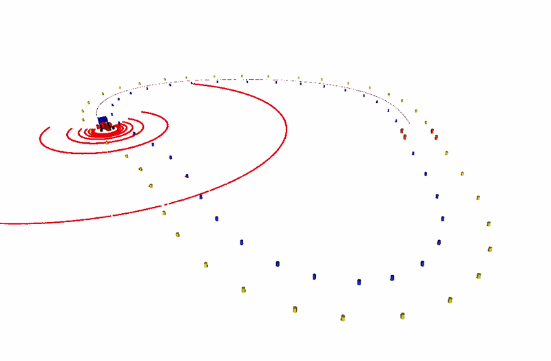
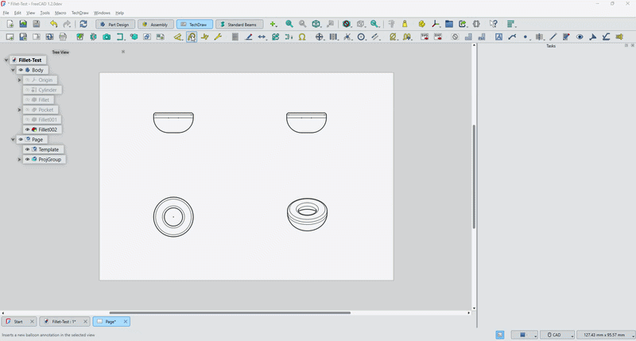

Engineering student working on whatever is interesting using software and hardware. Mostly working on software creating hardware or software controlling hardware. 

## Projects

### Autonomous Formula Student Car

Working at my university's Formula Student team, I have had the privilege of working on its driverless system.

The system works using ROS2 and runs on our own simulator (visualized in RViz)

Working on Localization, Perception, Control, Path-Planning and more.

### Google Summer of Code

I have been part of the Google Summer of Code program with the FreeCAD organization, where I worked on making the built-in technical drawing workbench more user friendly.

The work focused mostly on post selection, and in this example, how annotation balloons get placed.

[My Google Summer of Code Project](https://github.com/MortenVajhoj/GSoC-Project-2026)